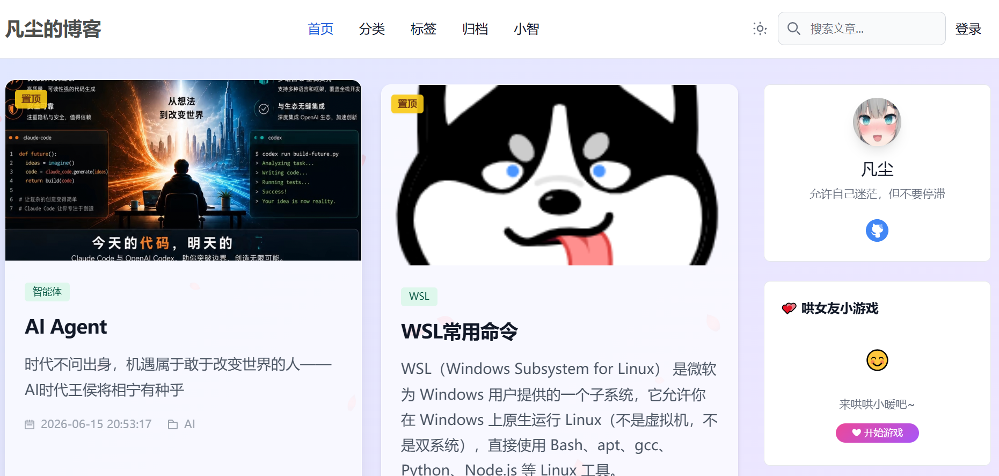
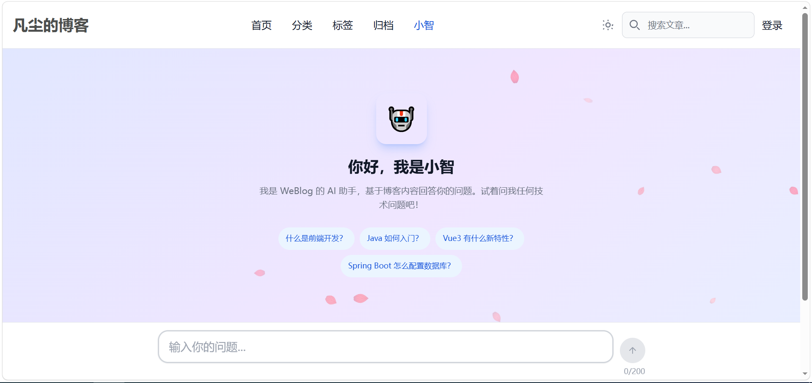
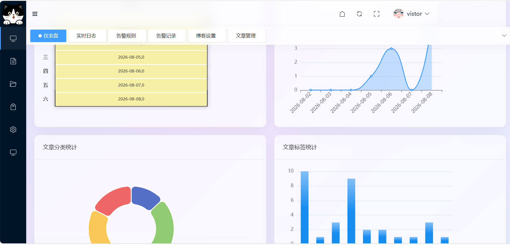

<div align="center">

# 🧊 WeBlog — 给博客装上 AI 大脑

**一个人从零开发的全栈博客系统：自研 RAG 智能问答 + AOP 运维监控告警 + JWT 安全认证**

[](https://spring.io/projects/spring-boot)
[](https://www.java.com/)
[](https://vuejs.org/)
[](https://www.mysql.com/)
[](LICENSE)
[](https://github.com/frefsd/weblog)

</div>

---

## ✨ 为什么值得一看

| | 亮点 | 说明 |
|---|---|---|
| 🤖 | **自研 RAG，零外部向量库** | 不依赖 Milvus / ES / Pinecone，自实现 Embedding 存储 + 余弦相似度检索，JSON 文件持久化，轻量可跑 |
| ⚡ | **SSE 流式 AI 对话** | 逐 token 输出 + 引用来源跳转 + 24h 会话管理 + 随时中断，体验接近 ChatGPT |
| 🔔 | **AOP 全链路监控告警** | 零侵入切面采集所有请求，慢请求标记 + 时间窗口阈值触发 + 邮件通知，业务代码零改动 |
| 🔐 | **JWT + Redis 白名单** | 解决 JWT 无法主动失效的痛点——退出登录/改密即时生效 |
| 🧩 | **6 模块事件驱动架构** | 文章发布自动触发 AI 索引更新，模块间零硬编码依赖 |
| 🎨 | **前后端双 UI 体系** | 前台 Flowbite + TailwindCSS，后台 Element Plus + ECharts 仪表盘 |

> 💡 前端界面设计参考了开源项目 [WeBlog](https://gitee.com/AllenJiang/WeBlog)，后端架构、数据库设计与业务逻辑完全独立开发。

---

## 🚀 在线体验

**访客账号**（免注册，直接登录）：

| 用户名 | 密码 |
|--------|------|
| `vistor` | `vistor` |

> 🌐 在线体验：**[https://www.fanchen.tech](https://www.fanchen.tech)**（已部署上线）

---

## 📸 界面预览

| 前台首页 | AI 智能问答 |
|---------|------------|
|  |  |

| 后台仪表盘 |
|-----------|
|  |

---

## 🛠 技术栈

**后端**：Spring Boot 3.5.9 · Java 17 · MyBatis-Plus 3.5.10 · Spring Security 6 · jjwt 0.12.5 · MySQL 8.0 · Redis (Lettuce) · Aliyun OSS · SpringDoc OpenAPI · 智谱 GLM-4（RestClient 纯 API 调用）

**前端**：Vue 3.2 (Composition API) · Vite 4.1 · Vue Router 4 · Vuex 4 · Element Plus · TailwindCSS · WindiCSS · ECharts 5.4 · mavon-editor / md-editor-v3 · Axios · GSAP

**AI**：RAG 检索增强生成 · 自研 InMemoryEmbeddingStore · 文本分块引擎 · SSE 流式对话 · 事件驱动增量索引

---

## 🏗 系统架构

```text
┌──────────────────────────────────────────────────────────────┐
│                        前端 (Vue 3)                           │
│               weblog-vue3/ · Vite · 端口 6066                 │
│         API 封装 / 路由鉴权守卫 / Vuex / 双 UI 体系           │
└──────────────────────────┬───────────────────────────────────┘
                           │ HTTP + SSE（/api 代理 → 8081）
                           ▼
┌──────────────────────────────────────────────────────────────┐
│                    后端 (Spring Boot 3.5.9)                   │
├───────────┬───────────┬──────────────┬──────────────────────┤
│ weblog-   │ weblog-   │ weblog-      │ weblog-ai            │
│ common    │ pojo      │ monitor      │ (RAG + GLM + SSE)    │
│ 安全/工具  │ DTO/VO/   │ AOP 日志/    │ 向量检索/会话/事件    │
│ 全局异常   │ Entity    │ 告警引擎     │ 驱动增量索引          │
├───────────┴───────────┴──────────────┴──────────────────────┤
│                    weblog-server（启动入口）                  │
│          7 管理接口 + 7 前台接口 + 14 Service + 11 Mapper    │
└──────────────────────────┬───────────────────────────────────┘
                           │ MyBatis-Plus
                           ▼
            ┌─────────────────────────────┐
            │     MySQL 8.0（15 张表）     │
            │  业务表统一逻辑删除 + 自动填充 │
            └─────────────────────────────┘
```

**模块依赖方向**：`weblog-server → weblog-ai / weblog-monitor → weblog-common → weblog-pojo`，通过 `ApplicationEventPublisher` + `@TransactionalEventListener(AFTER_COMMIT)` 实现跨模块解耦。

---

## 🏃 快速开始

### 环境要求

JDK 17+ · MySQL 8.0+ · Node.js 16+ · Maven 3.6+

### 1️⃣ 初始化数据库

```bash
mysql -u root -p -e "CREATE DATABASE weblog CHARACTER SET utf8mb4 COLLATE utf8mb4_general_ci;"
mysql -u root -p weblog < sql/weblog.sql
```

### 2️⃣ 配置后端

复制 `application-example.yaml` 为 `application-local.yaml`，填入你的配置：

```yaml
spring:
  datasource:
    url: jdbc:mysql://localhost:3306/weblog
    username: root
    password: 你的数据库密码

ai:
  zhipu:
    api-key: 你的智谱APIKey   # https://open.bigmodel.cn/

# 可选：阿里云 OSS（上传图片）、QQ 邮箱授权码（告警通知）
```

> 🔐 **安全建议**：数据库密码、API Key、JWT 密钥等敏感信息**建议通过环境变量注入**，而非写死在 yaml 中；仓库中仅保留占位符模板。

### 3️⃣ 启动

```bash
# 后端（根目录）
mvn clean install -DskipTests
mvn spring-boot:run -pl weblog-server -DskipTests
# → http://localhost:8081/swagger-ui.html（API 文档）

# 前端
cd weblog-vue3 && npm install && npm run dev
# → http://localhost:6066（/api 自动代理到 8081）
```

---

## 📚 接口概览

**后台**（JWT 认证）：文章/分类/标签/用户 CRUD · 仪表盘统计 · 博客设置 · `POST /ai/admin/rebuild`（重建向量索引）

**前台**（免认证）：`/index` 首页 · `/article` 文章详情 · `/category` / `/tag` 分类标签 · `/archive` 归档 · `/search` 搜索 · `/blog` 博客设置 · `/game` AI 文字游戏 · `/ai/chat` 非流式对话 · `/ai/chat/stream` SSE 流式对话 · `/ai/session/*` 会话管理

完整接口文档见启动后的 Swagger UI。

---

## 🧠 关键设计

### AI 问答（RAG）流程

```text
文章发布/更新 ──► ArticleChangeEvent ──► 事务提交后异步重建向量索引
                                              │
读者提问 ──► 向量检索 Top-K（余弦相似度）──► 组装 Prompt（系统指令+历史+RAG上下文）
                                              │
                                  智谱 GLM API（SSE 逐 token 返回）
```

- **索引**：`VectorIndexInitializer` 首次部署自动构建，文章变更事件驱动增量更新
- **检索**：自研 `InMemoryEmbeddingStore`，数据量可控时无需重型中间件，JSON 持久化
- **会话**：24h 过期自动续期，前端 localStorage 持久化 sessionId

### 监控告警流程

```text
请求 → ControllerMonitorAspect（AOP，零侵入）
     ├── 记录 URI/耗时/IP/异常 → LogEvent → 异步持久化 monitor_log
     └── 慢请求（>3s）→ WARN 标记
定时扫描告警规则 → 时间窗口内命中数 ≥ 阈值 → 写告警记录 + 邮件通知
```

### 安全认证流程

```text
登录 → AuthenticationManager 校验 → 签发 JWT → 写入 Redis 白名单
请求 → JwtAuthenticationFilter → 解析 JWT → 校验 Redis 白名单 → SecurityContextHolder
```

---

## 🚢 部署

```bash
# 后端：构建可执行 JAR
mvn clean package -DskipTests
java -jar weblog-server/target/weblog-server-0.0.1-SNAPSHOT.jar --spring.profiles.active=prod

# 前端：构建静态资源
cd weblog-vue3 && npm run build   # → dist/，交给 Nginx
```

Nginx 关键配置：

```nginx
location / {
    root /path/to/dist;
    index index.html;
    try_files $uri $uri/ /index.html;
}
location /api/ {
    proxy_pass http://localhost:8081/;
}
```

---

## 📄 许可证 & 致谢

- 本项目基于 **MIT 许可证**开源
- 前端界面设计与交互参考 [WeBlog](https://gitee.com/AllenJiang/WeBlog)，感谢原作者的启发
- 感谢 [Spring Boot](https://spring.io/projects/spring-boot) · [Vue.js](https://vuejs.org/) · [Element Plus](https://element-plus.org/) · [MyBatis-Plus](https://baomidou.com/) · [智谱 AI](https://open.bigmodel.cn/) 等所有开源依赖

---

<div align="center">

**如果这个项目对你有帮助，欢迎 ⭐ Star 支持！**

📺 相关视频：[B 站视频链接（发布后替换）]

</div>
